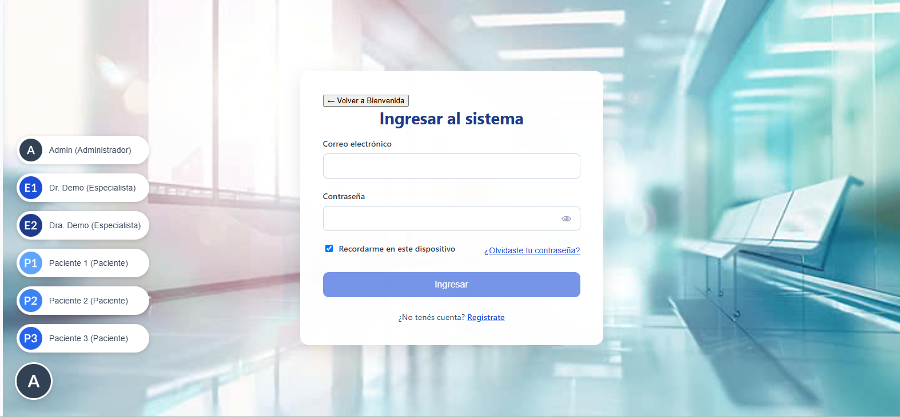
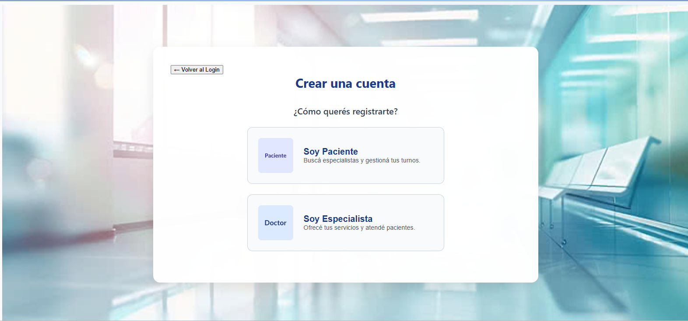
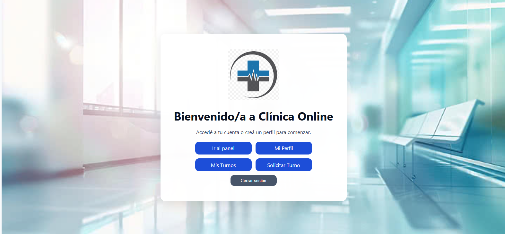
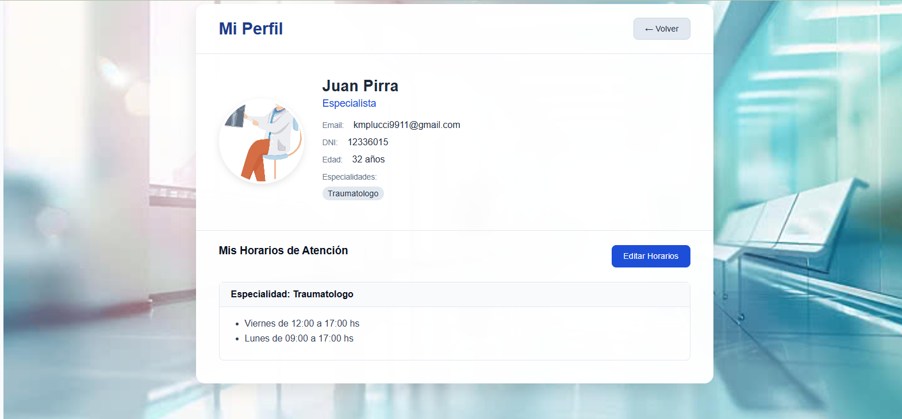
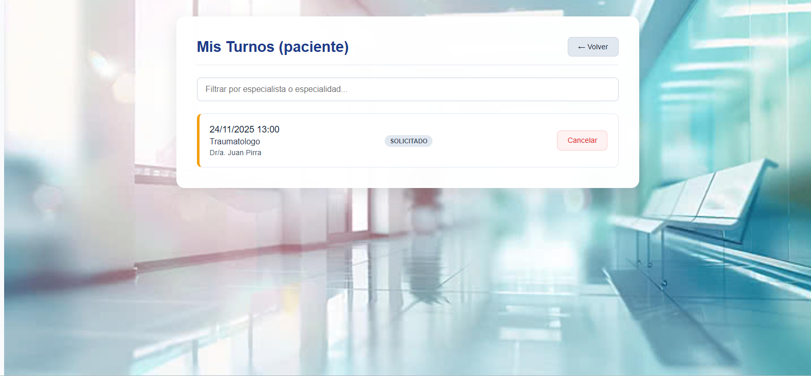
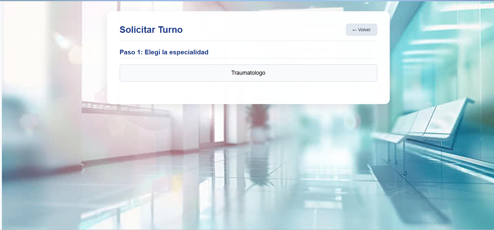
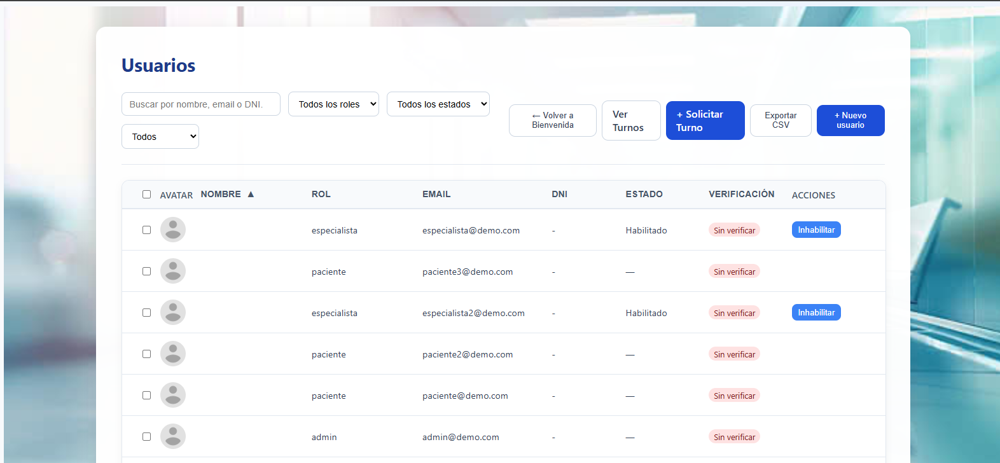

Clínica Online - Documentación

Este documento detalla la estructura, secciones y funcionalidades de la aplicación de gestión de turnos "Clínica Online".

1. Explicación de la Clínica

Clínica Online es una aplicación web desarrollada en Angular que permite la gestión integral de turnos médicos, conectando a pacientes, especialistas y administradores en una sola plataforma.

La aplicación maneja tres roles de usuario principales:

Paciente: Puede registrarse, solicitar turnos con especialistas, ver su historial y calificar la atención.

Especialista: Puede registrarse (requiere aprobación), gestionar su agenda, definir sus horarios de trabajo, y atender turnos.

Administrador: Tiene control total sobre la plataforma, pudiendo habilitar/inhabilitar especialistas, gestionar usuarios y ver todos los turnos del sistema.

2. Pantallas y Secciones

A continuación se detallan las pantallas de la aplicación, cómo acceder y qué contiene cada una.

2.1. Páginas Públicas (Sin Iniciar Sesión)

Login (/login)

Acceso: Botón "Ingresar" en la Bienvenida o al visitar una ruta protegida.

Contenido:

Formulario de Email y Contraseña.

Botón "FAB" (flotante) en la esquina inferior izquierda con 6 accesos rápidos de usuarios de prueba (3 Pacientes, 2 Especialistas, 1 Admin) para facilitar las pruebas.

Enlace para ir al Registro.

Registro (/registro)

Acceso: Botón "Registrarse" en la Bienvenida o enlace en el Login.

Contenido:

Paso 1: Selección de Rol. El usuario debe elegir si se registra como "Paciente" o "Especialista" mediante dos botones rectangulares.

Paso 2: Formulario. Al seleccionar un rol, aparece el formulario correspondiente:

Paciente: Pide Nombre, Apellido, Edad, DNI, Obra Social, Email, Contraseña y 2 fotos de perfil.

Especialista: Pide Nombre, Apellido, Edad, DNI, Especialidad(es), Email, Contraseña y 1 foto de perfil.

Captcha: Ambos formularios incluyen un Google reCAPTCHA v2 ("No soy un robot") que debe ser completado para poder registrarse.

2.2. Secciones Comunes (Logueados)

Bienvenida (/bienvenida)

Acceso: Es la página principal al ingresar a la aplicación o al hacer login.

Contenido:

Es el "HUB" o panel de navegación principal.

Muestra botones de acción rápida que cambian según el rol del usuario.

Todos: Ven el botón "Mi Perfil".

Paciente: Ve "Mi Perfil", "Mis Turnos" y "Solicitar Turno".

Especialista: Ve "Mi Perfil" y "Mis Turnos".

Admin: Ve "Mi Perfil" y "Ir al panel" (que lo lleva a /admin/usuarios).

Mi Perfil (/mi-perfil)

Acceso: Botón "Mi Perfil" en la pantalla de Bienvenida.

Contenido:

Muestra la información del usuario (Foto, Nombre, Apellido, Email, DNI, etc.).

Si el usuario es un Paciente, muestra sus dos fotos de perfil.

Sección "Mis Horarios" (Solo Especialistas):

Permite al Especialista definir su disponibilidad horaria.

Puede agregar/quitar franjas horarias (Día de la semana, Hora Desde, Hora Hasta) por cada una de sus especialidades.

Estos horarios son los que se usarán en la pantalla "Solicitar Turno".

2.3. Secciones de Paciente y Especialista

Mis Turnos (/mis-turnos)

Acceso: Botón "Mis Turnos" en la Bienvenida (visible para Pacientes y Especialistas).

Contenido: La vista se adapta según el rol:

Para Pacientes:

Muestra una lista de sus turnos solicitados.

Filtro único para buscar por Especialista o Especialidad.

Acciones disponibles según el estado del turno:

Cancelar: Si el turno está "Solicitado" o "Aceptado". Pide un comentario.

Ver Reseña: Si el turno está "Realizado" y el especialista dejó un comentario.

Calificar Atención: Si el turno está "Realizado" y el paciente aún no dejó su comentario.

Completar Encuesta: Si el turno está "Realizado" y el especialista ya dejó su reseña.

Para Especialistas:

Muestra una lista de los turnos que tiene asignados.

Filtro único para buscar por Paciente o Especialidad.

Acciones disponibles según el estado del turno:

Aceptar: Si el turno está "Solicitado".

Rechazar: Si el turno está "Solicitado". Pide un comentario.

Cancelar: Si el turno está "Aceptado". Pide un comentario.

Finalizar Turno: Si el turno está "Aceptado". Pide una reseña/diagnóstico.

Ver Reseña: Si el turno está "Realizado", "Cancelado" o "Rechazado" y tiene un comentario.

Solicitar Turno (/solicitar-turno)

Acceso: Botón "Solicitar Turno" en Bienvenida (Pacientes) o en el Panel de Admin (Administradores).

Contenido: Es un asistente de 3 pasos:

Paso 1: Elegir Especialidad.

Paso 2: Elegir Especialista. (Se filtra según la especialidad elegida).

Paso 3: Elegir Día y Horario.

No se usa un Datepicker. Se muestra una lista de los próximos 15 días en los que el especialista trabaja (según su configuración en "Mi Perfil").

Al elegir un día, se genera una grilla de botones con los horarios (ej: 09:00, 09:30...).

El sistema consulta los turnos ya existentes y deshabilita automáticamente los botones de horarios ya ocupados.

Vista de Administrador: El Admin ve un selector adicional en la parte superior para elegir a qué paciente le está asignando el turno.

2.4. Secciones de Administrador (/admin)

Panel de Usuarios (/admin/usuarios)

Acceso: Botón "Ir al panel" en la Bienvenida del Admin.

Contenido:

Muestra una tabla con todos los usuarios del sistema (Pacientes, Especialistas, Admins).

Permite filtrar por nombre, email, DNI, rol, estado de habilitación y estado de verificación.

Permite ordenar la tabla por columnas.

Acciones:

Habilitar/Inhabilitar: Para aprobar o rechazar a los Especialistas que se registran.

- Nuevo Usuario: Lleva a un formulario para crear usuarios (no implementado en este sprint).

Exportar CSV: Descarga un CSV de los usuarios filtrados.

Ver Turnos: Navega a la pantalla /admin/turnos.

- Solicitar Turno: Navega a la pantalla /solicitar-turno (en modo Admin).

Panel de Turnos (/admin/turnos)

Acceso: Botón "Ver Turnos" en el Panel de Usuarios del Admin.

Contenido:

Muestra una lista de todos los turnos de la clínica.

Filtro único para buscar por Paciente, Especialista o Especialidad.

Acciones:

Cancelar: Permite al Admin cancelar cualquier turno que esté en estado "Solicitado". Pide un comentario.
